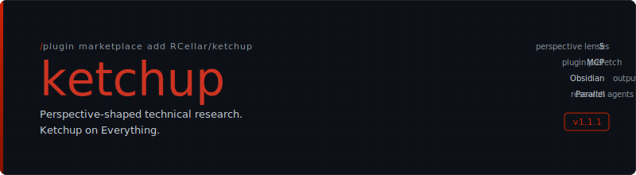

<p align="center">
  
</p>

<p align="center">
  <strong>Ketchup on Everything.</strong><br/>
  A Claude Code skill that generates in-depth technical research reports<br/>
  shaped for your professional background.
</p>

<p align="center">
  <a href="#install">Install</a> &middot;
  <a href="#quick-start">Quick Start</a> &middot;
  <a href="#flags">Flags</a> &middot;
  <a href="#plugins">Plugins</a> &middot;
  <a href="#config">Config</a>
</p>

---

## Install

**Step 1:** Add the marketplace (one-time setup):

```
/plugin marketplace add RCellar/ketchup
```

**Step 2:** Install the plugin:

```
/plugin install ketchup@rcellar-ketchup
```

Then run `/reload-plugins` to activate. Skills are namespaced as `/ketchup:<skill>`.

## Quick Start

**Set your perspective, then research anything:**

```bash
# Tell ketchup who you are
/ketchup --occ "Windows Systems Engineer"

# Research a topic — shaped for you
/ketchup --tgt "SELinux Administration"
```

That's it. Ketchup decomposes the topic into facets, dispatches parallel research agents, and synthesizes an Obsidian-ready report that explains SELinux through the lens of Windows security concepts you already know — GPO, integrity levels, ACLs, Event Viewer, and more.

**One-liner with everything:**

```bash
/ketchup --occ "Windows Systems Engineer" --tgt "SELinux Administration" --plugin "Context7" --time 6
```

This tells ketchup: *"I'm a Windows sysadmin who hasn't been deep in the weeds for 6 years. Use Context7 docs. Ketchup me on SELinux."*

## Flags

| Flag | What it does | Example |
|------|-------------|---------|
| `--occ` | Your occupation — shapes vocabulary, analogies, assumed knowledge | `--occ "DBA"` |
| `--tgt` | Topic to research | `--tgt "Kubernetes"` |
| `--plugin` | MCP data sources for pre-fetch (comma-separated) | `--plugin "Context7"` |
| `--time` | Years since your last deep engagement | `--time 6` |
| `--registry` | Manage plugins: `list`, `add`, `remove` | `--registry list` |
| `--fmt` | Output format: `obsidian` (default) or `notebook` | `--fmt notebook` |
| `--kernel` | Kernelspec for notebook code cells: `python` or `bash` | `--kernel bash` |
| `--annotate` | Reprocess a ketchup notebook for inline queries | `--annotate ./report.ipynb` |

## Jupyter Notebook Output

Ketchup can output directly to Jupyter notebooks with executable code cells — ideal for hands-on learning topics.

```bash
/ketchup --occ "Linux Enthusiast" --tgt "systemd Service Management" --fmt notebook --kernel bash
```

**What changes from Obsidian output:**

| Obsidian | Notebook |
|----------|----------|
| YAML frontmatter | `metadata.ketchup` JSON namespace |
| `> [!tip]` callouts | HTML `<div class="alert">` divs |
| `[[wikilinks]]` | Standard markdown links |
| Fenced code blocks | Executable code cells (when language matches `--kernel`) |
| Static document | Runnable, annotatable document |

### Annotating Notebooks

After generating a notebook, you can ask follow-up questions directly inside it. Add a markdown cell anywhere with `%%ketchup` on the first line:

```
%%ketchup
Expand on how SELinux booleans work — give me practical examples.
```

Then run:

```bash
/ketchup --annotate ./my-report.ipynb
```

Ketchup reads the perspective, plugins, and topic from the notebook's metadata (no need to re-specify `--occ`), dispatches a sonnet agent for each query, and inserts the response directly after the query cell.

**Annotation index:** Each processed query is replaced with a compact marker (`*[Annotation #1](#ketchup-annotation-index)*`) and the full query text is preserved in cell metadata. An annotation index table is appended to the end of the notebook, rebuilt on every `--annotate` run.

**Idempotency:** Answered queries are tagged `ketchup:query-answered` and skipped on re-runs. To re-ask, replace the marker with a new `%%ketchup` cell.

## How It Works

```
/ketchup --occ "Frontend Dev" --tgt "PostgreSQL" --plugin "Context7"
```

1. **Scope & decompose** — Breaks the topic into 2-6 facets tuned to what matters for a frontend dev learning Postgres (not a DBA learning Postgres — different facets entirely)
2. **Plugin pre-fetch** — Orchestrator queries Context7 for current Postgres docs, tags results per facet
3. **Pass 1: Fact extraction (haiku)** — Cheap, fast agents collect raw facts, sources, and commands per facet via web search. No perspective shaping yet — just research.
4. **Pass 2: Perspective shaping (sonnet)** — Each facet's raw research is reshaped for the reader's occupation and staleness window. No re-research — only reshaping Pass 1 output.
5. **Validate & synthesize** — Citation audit, contradiction check, deduplicate, restore perspective across all sections
6. **Format & output** — Obsidian markdown (default) or Jupyter notebook (`--fmt notebook`) with executable code cells, HTML callouts, and ketchup metadata
7. **Verification (haiku)** — Independent agent checks frontmatter, section completeness, citation compliance, and confidence scoring before delivery

### Cost Discipline

Ketchup uses a two-pass research model to control agent costs:

| Pass | Model | Purpose | Why this model |
|------|-------|---------|----------------|
| 1 — Fact extraction | **haiku** | Collect raw facts, sources, commands | Mechanical research — cheap and fast |
| 2 — Perspective shaping | **sonnet** | Reshape facts for the reader | Requires judgment — worth the cost |
| 2 (complex facets) | **opus** | Cross-domain synthesis | Only when facet covers >3 subtopics |
| Verification | **haiku** | Structural + citation checks | Mechanical validation — no judgment needed |
| Annotation | **sonnet** | Answer `%%ketchup` queries in notebooks | Perspective shaping — one per query, parallel |

A dispatch table in the skill file governs model selection. The orchestrator consults it before every agent call — no ad-hoc escalation.

### Confidence Scoring

Every report gets a confidence grade based on citation density:

| Grade | Threshold | Meaning |
|-------|-----------|---------|
| **high** | >70% sourced claims | Most facts have URLs |
| **medium** | 40-70% sourced | Mixed sourcing |
| **low** | <40% sourced | Mostly unsourced or inferred |

The verification agent counts sourced vs unsourced vs inferred claims and sets the `confidence` field in frontmatter automatically.

## Perspective Shaping

Ketchup doesn't just add analogies. It restructures content through five lenses:

| Lens | What it does |
|------|-------------|
| **Vocabulary bridging** | Maps concepts to equivalents you know |
| **Assumed knowledge** | Skips what your role implies you know |
| **Practical framing** | Leads with why this matters to *you* |
| **Risk calibration** | Matches warning intensity to your operational stakes |
| **Misconception correction** | Preempts wrong mental models your background creates |

### Knowledge Staleness (`--time`)

Haven't been in the weeds for a while?

```bash
/ketchup --occ "Java Developer" --tgt "Modern JavaScript" --time 8
```

Ketchup bridges from 2018-era JS (ES6 was still new, Webpack was king, class components everywhere) to today. Every major shift gets flagged: *"You may remember X — since then, Y replaced it."*

## Plugins

Plugins are opt-in MCP data sources that run at the pre-fetch layer. The orchestrator queries them *before* dispatching research agents, injecting authoritative docs into each subagent's context.

**Built-in plugins:**

| Plugin | Match | What it fetches |
|--------|-------|----------------|
| Context7 | `context7` | Current library/framework/SDK documentation |
| Microsoft Docs | `microsoft` | Official Microsoft and Azure documentation + code samples |

**Manage plugins:**

```bash
# List all registered plugins
/ketchup --registry list

# Add a new plugin (interactive — prompts for MCP tool workflow)
/ketchup --registry add "My Custom Docs"

# Add to the global registry instead of project-level
/ketchup --registry add "My Custom Docs" --global

# Remove a plugin
/ketchup --registry remove "My Custom Docs"
```

**Plugin registry files:**

| File | Scope | Notes |
|------|-------|-------|
| `<project>/.ketchup-plugins.yaml` | Project-level overrides | User-editable |
| `~/.ketchup-plugins.yaml` | User global additions | Written by `--registry add --global` |
| `skills/ketchup/plugin-registry.yaml` | Shipped defaults | Read-only — overwritten on plugin update |

## Config

Persist your defaults in a `.ketchup` YAML file so you don't have to type flags every time.

```yaml
# ~/.ketchup (global defaults)
occ: "Windows Systems Engineer"
time: 6
kernel: python
plugins:
  - context7
```

```yaml
# <project>/.ketchup (project override — replaces per-key, not deep-merged)
occ: "Cloud Infrastructure Engineer"
plugins:
  - context7
  - microsoft-docs
```

**Resolution order:** CLI flags > project `.ketchup` (walks up from cwd to git root or filesystem root) > global `~/.ketchup` > prompt user

| Override | How |
|----------|-----|
| Use a different occupation for one report | `--occ "New Role"` on the CLI |
| Disable staleness for one report | `--time 0` |
| Use different plugins for one report | `--plugin "Other"` (replaces config list) |

## Cite and Tag

Every ketchup report enforces a citation and tagging discipline defined in [`cite-and-tag.md`](skills/ketchup/cite-and-tag.md). The goal: no claim goes unattributed, no inference masquerades as fact, and every report is findable by topic.

### Citation Rules

Every factual claim in a report must carry one of these markers:

| Claim type | Format | Example |
|-----------|--------|---------|
| Fact with URL | Inline hyperlink | `SELinux uses MAC ([Red Hat docs](https://...))` |
| Fact, no URL available | `_(unsourced)_` | `Pocket doors are common in tight spaces _(unsourced)_` |
| Inference / probability | `_(~inferred: basis)_` | `This likely replaced the older module _(~inferred: pattern-match on changelog frequency)_` |
| URL not verified | `_(link unverified)_` | `See the migration guide ([docs](https://...)) _(link unverified)_` |
| Training data only (no search result) | Explicit flag | Marked so the reader knows it wasn't independently verified |

**Hard rules:**
- **No bare assertions.** If a claim has no marker, it's a bug in the report.
- **No "intuition" language.** LLMs don't have intuition. Use "pattern-match," "aggregate likelihood," or "low-confidence extrapolation" instead.

### Tagging

Reports are tagged via **YAML frontmatter** — Obsidian's canonical, indexable tag location. Tags never appear as inline blockquotes.

```yaml
tags:
  - ketchup
  - selinux
  - windows-sysadmin
```

**Tag rules:**
- Descriptive, searchable terms — not generic labels like `misc` or `general`
- Sanitized: lowercase, hyphens for spaces, cannot start with a number
- Obsidian's search and Dataview index frontmatter tags reliably, making reports queryable across a vault

### Enforcement

Citation compliance isn't just guidance — it's enforced at multiple stages of the pipeline:

1. **Subagent prompts** include the full citation ruleset inline
2. **Self-reported counts** — each subagent reports "X sourced, Y unsourced, Z inferred" at the end of its output
3. **Step 3a validation** — the orchestrator checks citation density before synthesis; facets with zero sourced citations are flagged as low-confidence
4. **Step 3b audit** — bare assertions are scanned for and either sourced, marked, or reframed before the final report is written

## Output Formats

### Obsidian Markdown (default)

- YAML frontmatter (`topic`, `perspective`, `date`, `confidence`, `source_count`, `tags`)
- `> [!abstract]`, `> [!tip]`, `> [!warning]` callouts
- Mermaid diagrams where helpful
- Tags in frontmatter for proper Obsidian search and Dataview indexing

### Jupyter Notebook (`--fmt notebook`)

- `metadata.ketchup` JSON namespace (same fields as Obsidian frontmatter)
- HTML alert divs instead of Obsidian callouts
- Code blocks matching `--kernel` extracted into executable code cells
- Standard markdown links instead of wikilinks
- Mermaid diagrams preserved (JupyterLab 4.1+ renders natively)
- Annotation support via `%%ketchup` inline queries

## File Structure

```
ketchup/
├── .claude-plugin/
│   ├── plugin.json          # Plugin metadata
│   └── marketplace.json     # Marketplace catalog
├── skills/
│   └── ketchup/
│       ├── SKILL.md              # Main skill definition
│       ├── notebook-format.md    # Jupyter notebook generation & annotation
│       ├── cite-and-tag.md       # Citation rules reference
│       └── plugin-registry.yaml  # MCP plugin registry
├── assets/
│   └── banner.svg
├── LICENSE
└── README.md
```

## License

MIT
