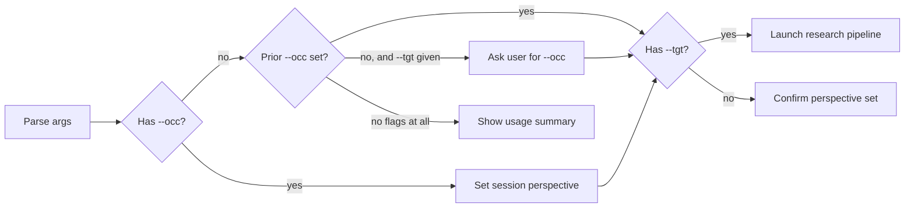

# Ketchup Skill v2 — Improvement Plan

> **For agentic workers:** REQUIRED SUB-SKILL: Use superpowers:subagent-driven-development (recommended) or superpowers:executing-plans to implement this plan task-by-task. Steps use checkbox (`- [ ]`) syntax for tracking.

**Goal:** Address all critical, moderate, and minor issues found during 5-agent review of the ketchup skill, producing a robust v2.

**Architecture:** Single-file skill (`SKILL.md`) + reference file (`cite-and-tag.md`). All changes are edits to these two files — no new files needed.

**Tech Stack:** Markdown (skill definition), Mermaid (replacing dot diagram), Claude Code skill system

---

### Task 1: Fix Description Field (CSO)

**Files:**
- Modify: `~/.claude/skills/ketchup/SKILL.md:3`

- [ ] **Step 1: Rewrite the description to lead with the most natural trigger**

```yaml
description: Use when catching up on unfamiliar tools, technologies, or concepts from a specific professional perspective — generates in-depth research reports shaped for the reader's occupation
```

Rationale: "catching up" is literally what "ketchup" means in this context. The current description buries it last. Leading with the natural trigger improves skill discovery.

- [ ] **Step 2: Verify the skill still appears in the skill list**

Invoke any skill to trigger a system reminder refresh and confirm `ketchup` appears with the updated description.

---

### Task 2: Fix Argument Parsing Spec

**Files:**
- Modify: `~/.claude/skills/ketchup/SKILL.md:10-17`

- [ ] **Step 1: Replace the vague parsing instruction with a complete spec**

Replace lines 10-17 with:

```markdown
## Arguments

| Flag | Required | Purpose | Example |
|------|----------|---------|---------|
| `--occ` | Yes (at least once per session) | Sets the reader's occupation/role — shapes vocabulary, analogies, and assumed knowledge | `--occ "Windows Systems Engineer"` |
| `--tgt` | No | Topic to research and report on | `--tgt "SELinux Administration"` |

### Parsing Rules

1. **Quoted values** — Extract the string between quotes: `--occ "Windows Systems Engineer"` → `Windows Systems Engineer`
2. **Unquoted values** — Consume everything from the flag to the next `--` flag or end of input: `--occ Network Engineer --tgt Kubernetes` → occ=`Network Engineer`, tgt=`Kubernetes`
3. **Single-dash typos** — Accept `-occ` and `-tgt` as aliases for `--occ` and `--tgt`
4. **Repeated flags** — Last value wins. Confirm the update: "Perspective updated to: {new value}"
5. **Neither flag provided** — Display usage summary and ask what the user wants to research
6. **Flag order** — Irrelevant. `--tgt X --occ Y` and `--occ Y --tgt X` are identical
```

- [ ] **Step 2: Verify no downstream references break**

Skim the rest of SKILL.md to confirm nothing references the old "Extract quoted strings" instruction.

---

### Task 3: Fix Flowchart — Replace Dot with Mermaid, Add Missing Nodes

**Files:**
- Modify: `~/.claude/skills/ketchup/SKILL.md:19-42`

- [ ] **Step 1: Replace the dot diagram and behavior matrix**

Replace lines 19-42 with:

````markdown
### Behavior by flag combination



- **`--occ` only:** Set the session perspective. Confirm it. All subsequent ketchup outputs adopt that lens. No report generated.
- **`--tgt` only (prior `--occ` exists):** Confirm active perspective ("Using perspective: {occ}"), then generate report.
- **`--tgt` only (no prior `--occ`):** Ask the user for their occupation. Treat their reply as the `--occ` value (with or without flag syntax). Confirm, then proceed.
- **Both flags:** Set perspective, then immediately generate the report.
- **Neither flag:** Display usage summary with examples. Prompt for at least `--occ`.
````

---

### Task 4: Fix Session State Documentation

**Files:**
- Modify: `~/.claude/skills/ketchup/SKILL.md:44-50`

- [ ] **Step 1: Add explicit session state section after the perspective lenses**

After the three perspective lenses (vocabulary bridging, assumed knowledge, practical framing), add:

```markdown
### Session State

- `--occ` is held in **conversation context only** — there is no persistent key-value store.
- Each new `--occ` invocation **replaces** the previous value (not stacked).
- Before launching any `--tgt` pipeline, **confirm the active perspective** in one line: "Using perspective: {occ value}. Generating report..."
- If context suggests the prior `--occ` may have scrolled out of the window, ask the user to confirm their occupation before proceeding.
```

---

### Task 5: Add Perspective Dimensions (Risk Tolerance, Misconceptions)

**Files:**
- Modify: `~/.claude/skills/ketchup/SKILL.md:46-50`

- [ ] **Step 1: Expand the three lenses to five**

Replace the current three-item list with:

```markdown
1. **Vocabulary bridging** — Map unfamiliar concepts to equivalents the reader already knows. A Windows sysadmin learning SELinux gets analogies to Windows MIC/integrity levels and GPO. A frontend dev learning Kubernetes gets analogies to component lifecycles and routing.
2. **Assumed knowledge** — Don't explain what the occupation already implies. A DBA doesn't need "a database stores data." A network engineer doesn't need TCP explained.
3. **Practical framing** — Lead with what this means for someone in their role. Why would they encounter this? What problems does it solve that they'd recognize?
4. **Risk & consequence calibration** — Match how risks are presented to the reader's occupational relationship with failure. A sysadmin with production responsibility gets explicit "this will break SSH" warnings. A student exploring gets "here's what breaks and why" framing.
5. **Preemptive misconception correction** — Anticipate wrong mental models the `--occ` reader will carry in. A Windows engineer will assume SELinux is like Windows Defender (it isn't). Address these in a dedicated "What This Is NOT" subsection before they calcify.
```

---

### Task 6: Restructure Research Pipeline — Context7 Pre-fetch, Facet Menu, Budget Caps

This is the largest task. It rewrites Steps 1-3 of the research pipeline.

**Files:**
- Modify: `~/.claude/skills/ketchup/SKILL.md:52-113`

- [ ] **Step 1: Rewrite Step 1 with facet decomposition menu and scope check**

Replace the current Step 1 (lines 56-65) with:

```markdown
### Step 1: Scope and decompose the topic

**Scope check first:**
- If `--tgt` is very narrow (single command, single flag): use 1-2 deep facets. Don't force artificial breadth.
- If `--tgt` is very broad (entire domain like "Cloud Computing"): either scope it to an aspect relevant to `--occ` before decomposing, or ask the user to narrow it.

**Decompose using standard lenses** — select the 2-6 most relevant for this `--occ`/`--tgt` combination:

| Lens | When to include |
|------|----------------|
| What it IS (conceptual model) | Always — foundational |
| How it maps to what `--occ` already knows | Always — this is ketchup's core value |
| Day-to-day operations (commands, workflows) | When `--tgt` involves tooling |
| Troubleshooting and failure modes | When `--occ` will operate/maintain this |
| Integration with adjacent tools `--occ` uses | When clear ecosystem overlap exists |
| Security and compliance implications | When `--occ` has operational responsibility |
| Performance and scaling considerations | When `--occ` works at scale |
| Migration or adoption path | When `--occ` is transitioning from something else |

Prefer fewer, deeper facets over many shallow ones. Bias toward facets that answer: "what would trip up a {--occ} specifically?"
```

- [ ] **Step 2: Add new Step 1.5 for Context7 pre-fetch**

Insert after Step 1:

```markdown
### Step 1.5: Pre-fetch documentation (if applicable)

**Subagents cannot access MCP tools.** The orchestrator must fetch documentation before dispatch.

If `--tgt` involves a documented library, framework, SDK, or CLI tool:

1. Resolve the library: `mcp__plugin_context7_context7__resolve-library-id` with the tool/library name
2. If found, query docs per facet: `mcp__plugin_context7_context7__query-docs` with a focused query string per facet (e.g., "SELinux policy types" not just "SELinux")
3. If no match found, skip — subagents will rely on web search
4. Attach relevant doc excerpts to each subagent's prompt as pre-fetched context

**Skip for:** Pure concepts with no associated tooling, soft skills, abstract theory.
```

- [ ] **Step 3: Rewrite Step 2 with updated agent prompt template**

Replace the current Step 2 (lines 67-103) with:

````markdown
### Step 2: Dispatch parallel research agents

Launch one agent per facet using the Agent tool with `model: "sonnet"`. Each agent receives:

- The facet to research
- The `--occ` context for perspective shaping
- Pre-fetched Context7 docs (if available from Step 1.5)
- Full cite-and-tag rules

**Agent prompt template:**

```
You are a research agent for the ketchup skill. Your task:

FACET: {facet_description}
READER OCCUPATION: {occ_value}
TARGET TOPIC: {tgt_value}

{If Context7 docs were pre-fetched for this facet:}
DOCUMENTATION (authoritative — use as primary source for factual claims):
{context7_excerpt}

Research this facet thoroughly using web search.

CITATION RULES (mandatory — apply to EVERY factual claim):
- Verifiable fact with URL → hyperlink inline: "claim ([source](url))"
- Fact, no URL available → append _(unsourced)_
- Inference/probability → append _(~inferred: brief basis)_
- Never present unsourced inference as bare assertion
- Never use "intuition" — use "pattern-match," "aggregate likelihood," or "low-confidence extrapolation"
- If you cannot verify a URL resolves, note _(link unverified)_
- If web search returns nothing useful for a claim, flag it explicitly — do NOT silently fall back to training data

OUTPUT FORMAT:
- Target 600-800 words for this facet — depth over breadth
- Shape explanations for a reader who is a {occ_value}
- Include concrete examples, commands, or configurations where relevant
- Do NOT repeat foundational concepts that other facets will cover
- End with: (a) list of sources used, (b) self-reported citation count: "X sourced, Y unsourced, Z inferred"
```
````

- [ ] **Step 4: Rewrite Step 3 with validation pass and contradiction checking**

Replace the current Step 3 (lines 105-112) with:

```markdown
### Step 3: Validate and synthesize

**Step 3a: Validate subagent output** (before any synthesis):

- If a subagent returned empty, errored, or off-topic: re-research that facet yourself
- If a subagent returned fewer than 200 words or zero sourced citations: flag it as low-confidence and supplement with your own research
- Check self-reported citation counts — if a facet is mostly unsourced/inferred, note this for the confidence assessment

**Step 3b: Citation audit:**

Scan all facet outputs for bare assertions (factual claims with no `([source](url))`, `_(unsourced)_`, or `_(~inferred:...)_` marker). Either source them, mark them, or reframe as inference before proceeding.

**Step 3c: Synthesize:**

1. **Check for contradictions** — Do any two facets make conflicting claims? Surface explicitly with `_(~inferred: sources conflict — see [section A] vs [section B])_`
2. **Deduplicate** — Merge thematically overlapping content under one authoritative section. Don't just remove duplicate sentences; restructure so each concept appears once in the most logical location.
3. **Bridge gaps** — Add cross-references (Obsidian wikilinks where appropriate) between sections where one explains something another assumes.
4. **Restore perspective** — If the `--occ` framing got lost in raw research, restore it. Every section should have at least one element specifically shaped for the reader's occupation.
5. **Shape the narrative** — Map synthesized content to the report template sections. The output of this step is a complete draft, not a content blob.
```

---

### Task 7: Fix Output Formatting — Obsidian Integration, Tags, Destination

**Files:**
- Modify: `~/.claude/skills/ketchup/SKILL.md:114-160`

- [ ] **Step 1: Rewrite Step 4 with explicit skill invocations, destination, and visualization strategy**

Replace the current Step 4 (lines 114-160) with:

````markdown
### Step 4: Format and output

**Before drafting:** Invoke `obsidian:obsidian-markdown` via the Skill tool to load Obsidian formatting conventions.

**Output destination:** Write the report as a markdown file. Ask the user where to save it (vault path, project directory, or output inline to chat). If the user has no preference, output inline.

Produce the final report as **Obsidian-flavored markdown**:

- YAML frontmatter with properties: `topic`, `perspective`, `date`, `tags`, `confidence` (high/medium/low based on citation density), `source_count`
- Use `> [!info]`, `> [!tip]`, `> [!warning]` callouts for key takeaways
- Tags belong in the **frontmatter `tags` list** — this is Obsidian's canonical tag location for search and Dataview queries
- Sanitize tags: no spaces (use hyphens), cannot start with a number, lowercase

**Visualization decision:**

| Situation | Use |
|-----------|-----|
| Sequential flows, architecture, process steps | Mermaid `flowchart` or `sequenceDiagram` in a fenced code block |
| Entity relationships, class hierarchies | Mermaid `classDiagram` or `erDiagram` in a fenced code block |
| 5+ entities with many cross-cutting relationships | Canvas file via `obsidian:json-canvas` — ask user first, requires Obsidian open |
| Obsidian may not be running | Mermaid only |

**Report template:**

```markdown
---
topic: "{tgt_value}"
perspective: "{occ_value}"
date: YYYY-MM-DD
confidence: high|medium|low
source_count: N
tags:
  - ketchup
  - {topic-tag}
  - {occ-tag}
---

# {tgt_value}: A Guide for {occ_value}s

> [!abstract] TL;DR
> {2-3 sentence executive summary bridging topic to occupation}

## Why This Matters to You
{Practical framing for the --occ reader}

## What This Is NOT
{Preemptive misconception correction — wrong mental models the --occ reader likely carries}

## Core Concepts
{Fundamentals with vocabulary bridging}

## {Facet sections...}
{Research content, shaped per perspective}

## Quick Reference
{Table or cheatsheet of most-used commands/concepts}

## Gotchas & Pitfalls
{Common mistakes, especially ones the --occ reader is likely to make}

## Further Reading
{Curated links, prioritized by relevance to --occ}
```

Note: The `date` field must be substituted with the actual current date in ISO 8601 format, not a placeholder string.
````

---

### Task 8: Consolidate Citation Rules — Eliminate DRY Violation

**Files:**
- Modify: `~/.claude/skills/ketchup/SKILL.md:162-170`

- [ ] **Step 1: Remove the redundant summary, keep only the reference pointer**

Replace the "Cite-and-Tag (Always Active)" section with:

```markdown
## Cite-and-Tag (Always Active)

All ketchup outputs follow cite-and-tag rules defined in `cite-and-tag.md` in this skill's directory. The orchestrating agent has access to this file directly. Subagents receive the rules inline in their prompt template (Step 2).

The cite-and-tag rules are the single source of truth. If updating citation behavior, update `cite-and-tag.md` first, then sync the subagent prompt template.
```

---

### Task 9: Rewrite Context7 Section

**Files:**
- Modify: `~/.claude/skills/ketchup/SKILL.md:172-181`

- [ ] **Step 1: Replace with section that reflects the pre-fetch architecture**

```markdown
## Context7 Usage

Context7 provides current documentation for libraries, frameworks, SDKs, and CLI tools. **MCP tools are only available to the orchestrating agent, not subagents.**

The orchestrator pre-fetches docs in Step 1.5 and passes them to subagents. The two-step workflow:

1. `mcp__plugin_context7_context7__resolve-library-id` — resolve the tool/library name to a Context7 ID
2. `mcp__plugin_context7_context7__query-docs` — query with per-facet focused strings (e.g., "SELinux policy types" not just "SELinux")

If `resolve-library-id` returns no match, skip — the topic has no Context7 entry. Fall back to web search.

**Skip for:** Abstract concepts with no associated tooling, soft skills, theory without a specific tool.
```

---

### Task 10: Update Common Mistakes Table

**Files:**
- Modify: `~/.claude/skills/ketchup/SKILL.md:183-192`

- [ ] **Step 1: Add rows for newly identified failure modes**

Replace the common mistakes table with:

```markdown
## Common Mistakes

| Mistake | Fix |
|---|---|
| Writing for experts when `--occ` implies beginner in that area | Re-read `--occ` — bridge from what they KNOW |
| Generic report with no occupation shaping | Every section needs at least one element specific to `--occ` |
| Skipping citations on "obvious" facts | Nothing is obvious cross-domain. Cite it or flag it. |
| Monolithic single-agent research | Use parallel subagents — breadth AND depth |
| Raw subagent output without synthesis | Always validate, deduplicate, and bridge across facets |
| Instructing subagents to use Context7/MCP tools | Subagents can't access MCP. Pre-fetch in Step 1.5 instead. |
| Ignoring subagent failures | Validate output before synthesis. Re-research empty/weak facets. |
| Blockquote tag line for Obsidian tags | Use frontmatter `tags:` list — Obsidian's canonical tag location |
| Passing full `--tgt` as Context7 query | Use per-facet focused query strings for better results |
| Forcing 6 facets on a narrow topic | Narrow topics get 1-2 deep facets. Don't pad. |
```

---

### Task 11: Update cite-and-tag.md — Add Obsidian Note

**Files:**
- Modify: `~/.claude/skills/ketchup/cite-and-tag.md:17-26`

- [ ] **Step 1: Add note distinguishing chat tagging from Obsidian tagging**

After the tagging format section, add:

```markdown
**Note for Obsidian outputs:** When producing Obsidian markdown files, tags belong in the YAML frontmatter `tags:` list, NOT in a blockquote tag line. The blockquote format above is for chat/conversation history tagging only. Obsidian's search and Dataview index frontmatter tags reliably; blockquote tags are not indexed consistently.
```

---

### Task 12: Final Review Pass

**Files:**
- Read: `~/.claude/skills/ketchup/SKILL.md` (full file after all edits)
- Read: `~/.claude/skills/ketchup/cite-and-tag.md` (full file after all edits)

- [ ] **Step 1: Read both files end-to-end and check for internal consistency**

Verify:
- No references to removed sections
- No duplicate content across sections
- Agent prompt template aligns with cite-and-tag.md
- Flowchart matches behavior matrix
- All skill cross-references use correct namespace format

- [ ] **Step 2: Word count check**

```bash
wc -w ~/.claude/skills/ketchup/SKILL.md
```

Target: under 1500 words. If over, identify sections that can be tightened without losing clarity.

- [ ] **Step 3: Verify skill is discoverable**

Invoke `/ketchup --help` or any other skill to trigger a system reminder and confirm ketchup appears with updated description.
