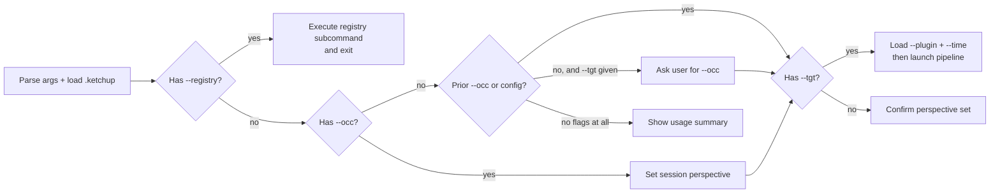

# Ketchup — Perspective-Shaped Technical Research

Research and report on technologies, skills, or concepts, shaped for the reader's professional background. Outputs are citation-backed, inference-flagged, and formatted for Obsidian. Supports opt-in MCP plugin prefetch and knowledge-staleness calibration.

## Arguments

| Flag | Type | Purpose | Example |
|------|------|---------|---------|
| `--occ` | Quoted string | Reader's occupation/role — shapes vocabulary, analogies, assumed knowledge | `--occ "Windows Systems Engineer"` |
| `--tgt` | Quoted string | Topic to research and report on | `--tgt "SELinux Administration"` |
| `--plugin` | Comma-separated string | MCP data sources for prefetch (opt-in) | `--plugin "Context7,Microsoft Docs"` |
| `--time` | Integer (years) | Knowledge staleness — years since last deep engagement | `--time 6` |
| `--registry` | Subcommand | Manage plugin registry: `list`, `add <name>`, `remove <name>` | `--registry list` |
| `--reset` | Flag (no value) | Clear session state (occ, time, plugins) mid-conversation | `--reset` |

### Parsing Rules

1. **Quoted values** — Extract string between quotes: `--occ "Windows Systems Engineer"` → `Windows Systems Engineer`
2. **Unquoted values** — Consume everything from flag to next `--` flag or end of input: `--occ Network Engineer --tgt Kubernetes` → occ=`Network Engineer`, tgt=`Kubernetes`
3. **Single-dash typos** — Accept `-occ`, `-tgt`, `-plugin`, `-time` as aliases for double-dash forms
4. **Repeated flags** — Last value wins. Confirm the update: "Perspective updated to: {new value}"
5. **Neither flag provided** — Check `.ketchup` config files for defaults (see Config section). If no config, display usage summary and prompt user
6. **Flag order** — Irrelevant. `--tgt X --occ Y` and `--occ Y --tgt X` are identical
7. **`--plugin` parsing** — Split on commas, trim whitespace: `"Context7, Microsoft Docs"` → `["context7", "microsoft-docs"]`
8. **`--time` validation** — Must be a non-negative integer (0-50 reasonable range). Reject negative numbers, decimals, and non-numeric values with: "Invalid --time value. Provide a whole number of years (e.g., `--time 6`)."
9. **`--reset`** — Clears session state (`--occ`, `--time`, active plugins) without restarting. Confirm: "Session state cleared. Set `--occ` to begin."

## `.ketchup` Config File

Persistent defaults for `--occ`, `--plugin`, and `--time`. Users edit these files directly.

**Hierarchy:** `~/.ketchup` (global) < `<project>/.ketchup` (project override). Project values **replace** global values per-key (not deep-merged).

**Project config search:** Starting from cwd, walk up parent directories looking for `.ketchup`. Stop at the git root (if in a repo) or the filesystem root (if not). First match wins.

```yaml
# ~/.ketchup (global defaults)
occ: "Windows Systems Engineer"
time: 6
plugins:
  - context7

# <project>/.ketchup (project override)
occ: "Cloud Infrastructure Engineer"
plugins:
  - context7
  - microsoft-docs
```

**Resolution order:**
1. CLI flags (always win)
2. Project `.ketchup`
3. Global `~/.ketchup`
4. No defaults — prompt user

**Rules:**
- `--plugin` on CLI replaces config `plugins` (not appends)
- `--time 0` explicitly means "current practitioner" (overrides config)
- Omitting `--time` entirely (no CLI, no config) = assume current knowledge
- Config `plugins` is a YAML list; `--plugin` is a comma-separated string. Both resolve to the same internal list.
- `--tgt` is never stored — always per-invocation

### Behavior by flag combination



- **`--occ` only:** Set the session perspective. Confirm it. No report generated.
- **`--tgt` only (prior `--occ` or config exists):** Confirm active perspective ("Using perspective: {occ}"), then generate report.
- **`--tgt` only (no prior `--occ`, no config):** Ask the user for their occupation. Treat their reply as the `--occ` value (with or without flag syntax). Confirm, then proceed.
- **Both flags:** Set perspective, then immediately generate the report.
- **Neither flag, no config:** Display usage summary with examples. Prompt for at least `--occ`.
- **Neither flag, config exists:** Load config defaults. Confirm: "Loaded defaults from {config path}: occ={occ}, plugins={list}, time={N}. Provide `--tgt` to generate a report."
- **`--registry` flag:** Execute registry subcommand (list/add/remove) and exit. No research pipeline.

## Session Perspective (`--occ` + `--time`)

When `--occ` is set, ALL ketchup outputs for the rest of the session adopt this lens:

1. **Vocabulary bridging** — Map unfamiliar concepts to equivalents the reader already knows. A Windows sysadmin learning SELinux gets analogies to Windows MIC/integrity levels and GPO. A frontend dev learning Kubernetes gets analogies to component lifecycles and routing.
2. **Assumed knowledge** — Don't explain what the occupation already implies. A DBA doesn't need "a database stores data." A network engineer doesn't need TCP explained.
3. **Practical framing** — Lead with what this means for someone in their role. Why would they encounter this? What problems does it solve that they'd recognize?
4. **Risk & consequence calibration** — Match how risks are presented to the reader's occupational relationship with failure. A sysadmin with production responsibility gets explicit "this will break SSH" warnings. A student exploring gets "here's what breaks and why" framing.
5. **Preemptive misconception correction** — Anticipate wrong mental models the `--occ` reader will carry in. A Windows engineer will assume SELinux is like Windows Defender (it isn't). Address these in a dedicated "What This Is NOT" subsection before they calcify.

### Knowledge Staleness (`--time`)

When `--time N` is set (N = years since last deep engagement):

- **Anchor vocabulary to the era** — Bridge from tools/patterns current N years ago, not today's stack. A Windows sysadmin with `--time 6` gets Server 2019 / PowerShell 5.1 as baseline, not Server 2025 / PowerShell 7.
- **Explicit change markers** — "You may remember X — since then, Y has replaced it" or "This didn't exist N years ago: [brief context]"
- **Don't assume recent knowledge** — Anything that emerged within the `--time` window needs introduction, even if `--occ` would normally imply familiarity
- **Calibrate density** — 2 years stale = light catch-up. 10 years stale = foundational re-orientation.

If `--time` is omitted (no CLI, no config), assume current practitioner.

### Session State

- `--occ` and `--time` are held in **conversation context only** — no persistent variable store.
- Each new `--occ` invocation **replaces** the previous value (not stacked). Same for `--time`.
- Before launching any `--tgt` pipeline, **confirm the active perspective** in one line: "Using perspective: {occ} | Staleness: {time}yr | Plugins: {list}. Generating report..."
- If context suggests a prior `--occ` may have scrolled out of the window, ask the user to confirm before proceeding.

## Research Pipeline (`--tgt`)

When `--tgt` is provided, execute a multi-agent research pipeline:

### Step 1: Scope and decompose the topic

**Scope check first:**
- If `--tgt` is very narrow (single command, single flag): use 1-2 deep facets. Don't force artificial breadth.
- If `--tgt` is very broad (entire domain like "Cloud Computing"): scope it to an aspect relevant to `--occ` before decomposing, or ask the user to narrow it.

**Decompose using standard lenses** — select the 2-6 most relevant for this `--occ`/`--tgt` combination:

| Lens | When to include |
|------|----------------|
| What it IS (conceptual model) | Always — foundational |
| How it maps to what `--occ` already knows | Always — ketchup's core value |
| Day-to-day operations (commands, workflows) | When `--tgt` involves tooling |
| Troubleshooting and failure modes | When `--occ` will operate/maintain this |
| Integration with adjacent tools `--occ` uses | When clear ecosystem overlap exists |
| Security and compliance implications | When `--occ` has operational responsibility |
| Performance and scaling considerations | When `--occ` works at scale |
| Migration or adoption path | When `--occ` is transitioning from something else |

Prefer fewer, deeper facets over many shallow ones. Bias toward facets that answer: "what would trip up a {--occ} specifically?"

### Step 1.5: Plugin pre-fetch (if any plugins active)

**Subagents cannot access MCP tools.** The orchestrator must fetch documentation before dispatch.

If no plugins are active (no `--plugin`, no config), skip this step entirely.

For each active plugin:
1. Normalize the plugin name (lowercase, trim whitespace, replace spaces with hyphens)
2. Look up in plugin registry (check in order: `<project>/.ketchup-plugins.yaml`, then `~/.ketchup-plugins.yaml`, then the shipped `plugin-registry.yaml`)
3. If found: execute the workflow steps in order, collecting results. Call with per-facet focused query strings (e.g., "SELinux policy types" not just "SELinux").
4. If not found: **discovery fallback** — scan available MCP tools for names containing the normalized string. Read MCP server instructions from system prompt. Construct best-effort workflow. Warn: "No registry entry for '{name}' — discovered MCP tools matching '{pattern}'. Attempting best-effort prefetch."
5. If discovery finds nothing: warn and skip: "No MCP tools found matching '{name}'. Proceeding without this plugin."

Tag each plugin's results with its name for subagent citation.

### Step 2: Dispatch parallel research agents

Launch one agent per facet using the Agent tool with `model: "sonnet"`. Each agent receives:

- The facet to research
- The `--occ` context for perspective shaping
- The `--time` staleness context (if set)
- Pre-fetched plugin docs (if available from Step 1.5), tagged by plugin name
- Full cite-and-tag rules

**Agent prompt template:**

```
You are a research agent for the ketchup skill. Your task:

FACET: {facet_description}
READER OCCUPATION: {occ_value}
TARGET TOPIC: {tgt_value}
{If --time is set:}
KNOWLEDGE STALENESS: The reader's last deep technical engagement was {time} years ago.
Bridge from tools/patterns current in {current_year - time}. Explicitly flag what
has changed since then. Do not assume familiarity with anything that emerged in the
last {time} years.

{If plugin docs were pre-fetched for this facet:}
PREFETCHED DOCUMENTATION ({plugin_name}):
{results}
Use this as an authoritative source for factual claims. Cite as ({plugin_name}).

Research this facet thoroughly using web search.

CITATION RULES (mandatory — apply to EVERY factual claim):
- Verifiable fact with URL → hyperlink inline: "claim ([source](url))"
- Fact, no URL available → append _(unsourced)_
- Inference/probability → append _(~inferred: brief basis)_
- Never present unsourced inference as bare assertion
- Never use "intuition" — use "pattern-match," "aggregate likelihood," or "low-confidence extrapolation"
- If you cannot verify a URL resolves, note _(link unverified)_
- If web search returns nothing useful for a claim, flag it explicitly — do NOT silently fall back to training data

OUTPUT FORMAT:
- Target 600-800 words for this facet — depth over breadth
- Shape explanations for a reader who is a {occ_value}
- Include concrete examples, commands, or configurations where relevant
- Do NOT repeat foundational concepts that other facets will cover
- End with: (a) list of sources used, (b) self-reported citation count: "X sourced, Y unsourced, Z inferred"
```

### Step 3: Validate and synthesize

**Step 3a: Validate subagent output** (before any synthesis):

- If a subagent returned empty, errored, or off-topic: re-research that facet yourself
- If a subagent returned fewer than 200 words or zero sourced citations: flag as low-confidence and supplement with your own research
- Check self-reported citation counts — if a facet is mostly unsourced/inferred, note this for the confidence assessment

**Step 3b: Citation audit:**

Scan all facet outputs for bare assertions (factual claims with no `([source](url))`, `_(unsourced)_`, or `_(~inferred:...)_` marker). Either source them, mark them, or reframe as inference before proceeding.

**Step 3c: Synthesize:**

1. **Check for contradictions** — Do any two facets make conflicting claims? Surface explicitly with `_(~inferred: sources conflict — see [section A] vs [section B])_`
2. **Deduplicate** — Merge thematically overlapping content under one authoritative section. Restructure so each concept appears once in the most logical location.
3. **Bridge gaps** — Add cross-references (Obsidian wikilinks where appropriate) between sections where one explains something another assumes.
4. **Restore perspective** — If the `--occ` framing got lost in raw research, restore it. Every section needs at least one element specifically shaped for the reader's occupation.
5. **Shape the narrative** — Map synthesized content to the report template sections. The output of this step is a complete draft, not a content blob.

### Step 4: Format and output

**Before drafting:** Invoke `obsidian:obsidian-markdown` via the Skill tool to load Obsidian formatting conventions.

**Output destination:** Ask the user where to save the report (vault path, project directory, or output inline to chat). If the user has no preference, output inline.

Produce the final report as **Obsidian-flavored markdown**:

- YAML frontmatter with properties: `topic`, `perspective`, `date`, `staleness` (if `--time` set), `plugins` (list of active plugins), `confidence` (high/medium/low based on citation density), `source_count`, `tags`
- Use `> [!info]`, `> [!tip]`, `> [!warning]` callouts for key takeaways
- Tags belong in the **frontmatter `tags:` list** only — do NOT add a blockquote tag line at end of document
- Sanitize tags: no spaces (use hyphens), cannot start with a number, lowercase

**Visualization decision:**

| Situation | Use |
|-----------|-----|
| Sequential flows, architecture, process steps | Mermaid `flowchart` or `sequenceDiagram` in a fenced code block |
| Entity relationships, class hierarchies | Mermaid `classDiagram` or `erDiagram` in a fenced code block |
| 5+ entities with many cross-cutting relationships | Canvas file via `obsidian:json-canvas` — ask user first, requires Obsidian open |
| Obsidian may not be running | Mermaid only |

**Report template:**

```markdown
---
topic: "{tgt_value}"
perspective: "{occ_value}"
date: YYYY-MM-DD
staleness: {time_value or omit if not set}
plugins:
  - {active plugins or omit if none}
confidence: high|medium|low
source_count: N
tags:
  - ketchup
  - {topic-tag}
  - {occ-tag}
---

# {tgt_value}: A Guide for {occ_value}s

> [!abstract] TL;DR
> {2-3 sentence executive summary bridging topic to occupation}

## Why This Matters to You
{Practical framing for the --occ reader}

## What This Is NOT
{Preemptive misconception correction — wrong mental models the --occ reader likely carries}

## Core Concepts
{Fundamentals with vocabulary bridging}

## {Facet sections...}
{Research content, shaped per perspective}

## Quick Reference
{Table or cheatsheet of most-used commands/concepts}

## Gotchas & Pitfalls
{Common mistakes, especially ones the --occ reader is likely to make}

## Further Reading
{Curated links, prioritized by relevance to --occ}
```

Note: The `date` field must be substituted with the actual current date in ISO 8601 format (e.g., `2026-04-03`), not a placeholder string.

## Plugin Registry

Plugins are registered in YAML files mapping friendly names to MCP tool workflows.

**File locations (resolution order):**

| File | Scope | Writable by user |
|------|-------|------------------|
| `<project>/.ketchup-plugins.yaml` | Project-level overrides | Yes |
| `~/.ketchup-plugins.yaml` | User-owned global additions | Yes (`--registry add --global` writes here) |
| `<plugin-install>/skills/ketchup/plugin-registry.yaml` | Ships with plugin (read-only defaults) | No — overwritten on plugin update |

After marketplace install, the shipped registry lands at `~/.claude/plugins/cache/<marketplace>/ketchup/<version>/skills/ketchup/plugin-registry.yaml`. Do not edit this file directly — it is overwritten on plugin updates. Use `--registry add --global` to write to `~/.ketchup-plugins.yaml` instead.

**Match field semantics:** The `match` field uses **substring matching** against the normalized plugin name. `"microsoft"` matches input `"microsoft-docs"`, `"microsoft"`, etc. Matching is case-insensitive after normalization.

**Format:**

```yaml
plugins:
  context7:
    match: "context7"
    description: "Current documentation for libraries, frameworks, and SDKs"
    workflow:
      - tool: "mcp__plugin_context7_context7__resolve-library-id"
        action: "Resolve topic to library ID"
      - tool: "mcp__plugin_context7_context7__query-docs"
        action: "Query per-facet with focused strings"
```

**`--registry` subcommands:**

| Command | Action |
|---------|--------|
| `--registry list` | Show all registered plugins (project + user + shipped) with source file |
| `--registry add <name>` | Prompt for match pattern, description, and workflow steps. Write to project-level `.ketchup-plugins.yaml` by default; `--global` writes to `~/.ketchup-plugins.yaml` |
| `--registry remove <name>` | Remove from project-level file (or `--global` for `~/.ketchup-plugins.yaml`) |

When `--registry add` prompts for workflow steps, list the available MCP tools from the current session to help the user select the right ones. If no MCP tools are available, the user can manually enter tool names (they can find these later when MCP servers are configured).

## Cite-and-Tag (Always Active)

All ketchup outputs follow cite-and-tag rules defined in `cite-and-tag.md` in this skill's directory. The orchestrating agent has access to this file directly. Subagents receive the rules inline in their prompt template (Step 2).

`cite-and-tag.md` is the single source of truth. If updating citation behavior, update that file first, then sync the subagent prompt template in Step 2.

## Common Mistakes

| Mistake | Fix |
|---|---|
| Writing for experts when `--occ` implies beginner in that area | Re-read `--occ` — bridge from what they KNOW |
| Generic report with no occupation shaping | Every section needs at least one element specific to `--occ` |
| Skipping citations on "obvious" facts | Nothing is obvious cross-domain. Cite it or flag it. |
| Monolithic single-agent research | Use parallel subagents — breadth AND depth |
| Raw subagent output without synthesis | Always validate, deduplicate, and bridge across facets |
| Instructing subagents to use MCP tools | Subagents can't access MCP. Pre-fetch in Step 1.5 instead. |
| Ignoring subagent failures | Validate output before synthesis. Re-research empty/weak facets. |
| Tags outside YAML frontmatter | Use frontmatter `tags:` list — Obsidian's canonical, indexable tag location |
| Passing full `--tgt` as plugin query | Use per-facet focused query strings for better results |
| Forcing 6 facets on a narrow topic | Narrow topics get 1-2 deep facets. Don't pad. |
| Running plugins without `--plugin` or config | Plugins are strictly opt-in. No prefetch without explicit request. |
| Ignoring `--time` in subagent prompts | Always include staleness context when set. It shapes everything. |

## Examples

**Set perspective only:**
```
/ketchup --occ "Full-Stack JavaScript Developer"
```
→ "Session perspective set to Full-Stack JavaScript Developer. All ketchup reports will bridge concepts to JS/web development patterns. Use `--tgt` to generate a report."

**Full invocation with plugins and staleness:**
```
/ketchup --occ "Windows Systems Engineer" --tgt "SELinux Administration" --plugin "Context7" --time 6
```
→ Pre-fetches SELinux docs via Context7, decomposes into facets, dispatches research agents (each aware the reader's last deep engagement was 2020-era Windows), synthesizes into an Obsidian report bridging SELinux through Windows security concepts.

**Using config defaults:**
```
# With ~/.ketchup containing occ, plugins, time:
/ketchup --tgt "Ansible Automation"
```
→ "Loaded defaults: occ=Windows Systems Engineer | time=6yr | plugins=context7. Generating report..."

**Registry management:**
```
/ketchup --registry list
/ketchup --registry add "Kubernetes Docs" --global
```
