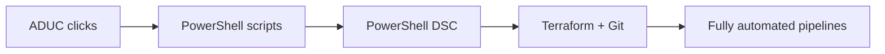

# Active Directory Architect: A Guide for Beginner AD Administrators

> [!abstract] TL;DR
> An AD architect designs the forests, domains, trusts, and security boundaries you maintain daily. Since your last deep engagement (~2020), the identity world has flipped: Entra ID (formerly Azure AD) is now the center of gravity, passwords are being eliminated, AD FS is being retired, and attackers have documented playbooks for every AD misconfiguration. This report bridges from where you are (ADUC, password resets, basic GPO) to where architects think — security tiers, attack paths, hybrid identity, automation, and disaster recovery.

## Why This Matters to You

You reset passwords, create users, maybe link a GPO. You inherited an Active Directory that someone else built. You see one domain, some OUs, a few DCs, and a Group Policy structure that probably makes sense to whoever designed it.

That "someone else" was an AD architect. They made deliberate decisions about every structural element you now maintain — how many domains, where the FSMO roles live, which sites have DCs, what trusts exist, how replication flows. Understanding those decisions is the difference between maintaining AD safely and accidentally undermining years of careful design.

Meanwhile, the identity landscape has shifted dramatically since 2020. Azure AD is now Entra ID. Cloud identity is now primary, on-prem is secondary. Passwords are being eliminated. New attack classes target AD infrastructure you may not know you're running. This report covers what an architect knows that you need to learn.

## What This Is NOT

> [!warning] Wrong mental models to discard

- **AD is not "just a user database."** It's a distributed, replicated, multi-master directory service with a security model, replication topology, schema, and trust architecture. The user list is the tip of the iceberg.
- **"We have one domain, so AD is simple."** One domain was a deliberate architectural choice. The replication topology, FSMO placement, site design, and security boundaries underneath it are complex.
- **"Azure AD/Entra ID is separate from my AD."** They're deeply intertwined via sync. Changes you make on-prem flow to the cloud and vice versa. An architect thinks about both as one identity system.
- **"Security is the security team's job."** In AD, the architecture IS the security. Every trust, every delegation, every service account password is part of the attack surface.
- **"I'll learn this when I need it."** The things in this report — DR procedures, security hardening, hybrid identity — are the things you need to know BEFORE the emergency, not during it.

---

## AD Architecture: What Your Architect Was Thinking

When you open ADUC and see a single domain like `contoso.com`, that's not a default — someone decided you didn't need more. Understanding those decisions helps you maintain what you inherited without breaking things you don't fully understand yet.

### The Hierarchy

| Layer | What it is | Architect's decision |
|-------|-----------|---------------------|
| **Forest** | Outermost security boundary. Shared schema, shared Global Catalog. | "Do we need hard isolation from another org?" If no → single forest. |
| **Domain** | Administrative boundary within a forest. Separate GPO, separate admin accounts. | "Do we need separate administration for a subsidiary?" If no → single domain. |
| **Site** | Logical grouping matching physical network topology. Controls replication and logon traffic. | "Does this office need a local DC?" If WAN is slow/expensive → yes. |
| **OU** | Delegation container within a domain. No security boundary. | "Who manages these users/computers?" Group by admin responsibility. |

([Microsoft Learn: AD Logical Model](https://learn.microsoft.com/en-us/windows-server/identity/ad-ds/plan/understanding-the-active-directory-logical-model))

Multiple forests exist for hard security isolation — acquired companies, classified environments. Multiple domains add admin overhead. The default and usually correct answer is: **one forest, one domain, delegate with OUs** _(~inferred: pattern-match from Microsoft's own recommendations and common enterprise deployments)_.

### FSMO Roles: Those Five Names in Your dcdiag Output

You've seen these in `dcdiag` or `netdom query fsmo` output. Each is a single-DC tiebreaker for operations that can't safely run on multiple controllers:

| Role | Scope | What it does | Why you'd notice it broken |
|------|-------|-------------|---------------------------|
| **Schema Master** | Forest | Only DC that can modify the AD schema | Exchange/SCCM install fails |
| **Domain Naming Master** | Forest | Controls adding/removing domains | Domain restructuring fails |
| **PDC Emulator** | Domain | Password changes, time sync, GPO source, account lockouts | "Wrong password" after resets, time skew |
| **RID Master** | Domain | Hands out SID pools for new object creation | Can't create new users/computers |
| **Infrastructure Master** | Domain | Tracks cross-domain references | Group membership display errors |

([Microsoft Learn: FSMO Roles](https://learn.microsoft.com/en-us/troubleshoot/windows-server/active-directory/fsmo-roles); [FSMO Placement](https://learn.microsoft.com/en-us/troubleshoot/windows-server/active-directory/fsmo-placement-and-optimization-on-ad-dcs))

Architects typically colocate Schema + Domain Naming on the forest root PDC, and RID on the domain PDC. The Infrastructure Master goes on a non-Global Catalog DC — unless every DC is a GC, in which case it doesn't matter.

### Sites and Replication

Your branch office has a DC because an architect looked at the WAN bandwidth and decided authentication traffic shouldn't cross it. **Sites** map to physical network topology — subnets grouped by connectivity. The **KCC** (Knowledge Consistency Checker) automatically builds replication topology: bidirectional rings within sites, spanning trees between sites weighted by **site link cost** ([Microsoft Learn: Replication Concepts](https://learn.microsoft.com/en-us/windows-server/identity/ad-ds/get-started/replication/active-directory-replication-concepts)).

### Trusts

If you've ever added a user from `partnercompany.com` to a security group and it worked, a trust made that possible. **Forest trusts** are transitive (A trusts B trusts C → A can auth through C). **External trusts** are non-transitive one-way links. **Shortcut trusts** optimize auth paths in large multi-domain environments ([Microsoft Learn: Forest Trust Concepts](https://learn.microsoft.com/en-us/entra/identity/domain-services/concepts-forest-trust)).

---

## Hybrid Identity & Entra ID: What Changed While You Were Away

> [!danger] Everything in this section is new or changed since 2020

### The Name Changed, and So Did Everything Else

Azure AD was rebranded to **Microsoft Entra ID** in July 2023 ([Microsoft Security Blog](https://www.microsoft.com/en-us/security/blog/2023/07/11/microsoft-entra-expands-into-security-service-edge-and-azure-ad-becomes-microsoft-entra-id/)). This isn't cosmetic. The strategic center of gravity has shifted: **Entra ID is now the primary identity system. Your on-premises AD is the supporting infrastructure.** In 2020 you thought of Azure AD as "the thing that handles O365 logins." That framing is now backwards.

### Conditional Access: GPO for Cloud, But Smarter

In 2020, you enforced access policy through GPO and network perimeter controls. That model assumed the network boundary was meaningful.

**Conditional Access** replaces it — a per-request policy engine evaluating identity, device health, location, and real-time risk signals every time someone accesses a resource ([Microsoft Learn: Conditional Access](https://learn.microsoft.com/en-us/entra/identity/conditional-access/overview)). The recommended approach targets "All cloud apps" so nothing slips through. Report-only mode lets you test policies before enforcing.

### AD FS Is Being Retired

**Kerberos Cloud Trust** replaces AD FS for hybrid authentication — Entra-joined devices obtain partial Kerberos tickets from Entra ID to access on-prem resources without federation servers ([Microsoft Learn: Cloud Kerberos Trust](https://learn.microsoft.com/en-us/windows/security/identity-protection/hello-for-business/deploy/hybrid-cloud-kerberos-trust)). The complex federation infrastructure you dreaded deploying is no longer the required path.

### Passwords Are Being Eliminated

MFA was nice-to-have in 2020. Now it's table stakes, and the direction beyond is **passwordless**: FIDO2, Windows Hello for Business, passkeys, Certificate-Based Authentication ([Microsoft Learn: Passwordless](https://learn.microsoft.com/en-us/entra/identity/authentication/concept-authentication-passwordless)). The goal is removing passwords as a phishable, sprayable credential entirely.

### Sync Architecture: Two Paths

**Entra Connect** (the old Azure AD Connect) runs the sync engine locally — needed for Pass-Through Auth, device sync, or hybrid join. **Entra Connect Cloud Sync** runs sync logic in Azure — simpler, lighter, Microsoft's stated long-term direction ([Microsoft Learn: Cloud Sync](https://learn.microsoft.com/en-us/entra/identity/hybrid/cloud-sync/what-is-cloud-sync)). Cloud Sync is especially suited for multi-forest M&A scenarios.

### Identity Governance

What used to require third-party tools is now built in: **Lifecycle Workflows** (joiner/mover/leaver), **Entitlement Management** (access packages), **Access Reviews** (periodic verification), **PIM** (just-in-time elevation instead of standing privileges) _(unsourced)_.

---

## Security Architecture: The Wake-Up Call

### The Tiered Administration Model

| Tier | Contains | If compromised... |
|------|----------|-------------------|
| **Tier 0** | Domain Controllers, AD, PKI, Entra Connect | Complete domain takeover |
| **Tier 1** | Business servers (SQL, Exchange, file servers) | Sensitive data exposure |
| **Tier 2** | Workstations, user devices | Lateral movement starting point |

([Microsoft Learn: Tiered Model](https://learn.microsoft.com/en-us/microsoft-identity-manager/pam/tier-model-for-partitioning-administrative-privileges); [Privileged Access Model](https://learn.microsoft.com/en-us/security/privileged-access-workstations/privileged-access-access-model))

The rule: **credentials from a lower tier never touch a higher tier.** Your Domain Admin account should never log into a workstation. Dedicated **Privileged Access Workstations** (PAWs) — no email, no browser — enforce this ([Microsoft Learn: PAW](https://learn.microsoft.com/en-us/security/privileged-access-workstations/privileged-access-devices)).

### Fix These Today

| Problem you probably have | Solution | Why it matters |
|--------------------------|----------|---------------|
| Same local admin password on every PC | **Windows LAPS** — auto-rotates unique passwords per machine ([Microsoft Learn: LAPS](https://learn.microsoft.com/en-us/windows-server/identity/laps/laps-overview)) | Stops lateral movement cold |
| Service accounts with "never expire" passwords | **gMSA** — AD manages password automatically, no human knows it ([Microsoft Learn: gMSA](https://learn.microsoft.com/en-us/windows-server/identity/ad-ds/manage/group-managed-service-accounts/group-managed-service-accounts/manage-group-managed-service-accounts)) | Defeats Kerberoasting |
| Too many Domain Admins | Tiered model + PIM for just-in-time elevation | Reduces blast radius |
| No visibility into attack paths | **BloodHound** — maps privilege escalation chains in your domain ([SANS](https://www.sans.org/blog/bloodhound-sniffing-out-path-through-windows-domains)) | Shows what attackers see |
| ADCS configured and forgotten | Audit for ESC1-ESC8 misconfigurations ([Crowe](https://www.crowe.com/insights/crowe-cyber-watch/exploiting-ad-cs-a-quick-look-at-esc1-esc8)) | Certificate-based domain compromise |

### Attack Paths You Should Know

| Attack | What it does | Defense |
|--------|-------------|---------|
| **Kerberoasting** | Cracks service account passwords offline ([ired.team](https://www.ired.team/offensive-security-experiments/active-directory-kerberos-abuse/t1208-kerberoasting)) | Use gMSA, enforce 25+ char passwords |
| **DCSync** | Replicates all password hashes from a DC | Audit replication permissions, monitor for unusual replication requests |
| **Golden Ticket** | Forges Kerberos TGTs with stolen krbtgt hash | Rotate krbtgt password twice, monitor for anomalous TGTs |
| **PetitPotam** | Forces DC to relay NTLM auth to attacker-controlled CA ([Optiv](https://www.optiv.com/insights/source-zero/blog/petitpotam-active-directory-certificate-services)) | Disable NTLM on DCs, harden ADCS |

> [!tip] The architect's mindset
> Assume breach. Design for containment. The question isn't "can we prevent all attacks?" — it's "when one machine is compromised, can the attacker reach Tier 0?"

---

## Automation & Infrastructure as Code

### The Maturity Progression

**Where you are:** ADUC clicks, maybe basic `Get-ADUser` / `Set-ADUser` scripts.

**Where architects live:** Declarative configuration files that describe the desired state, stored in git, applied automatically.

### Key Tools

| Tool | What it replaces | Example |
|------|-----------------|---------|
| `Install-ADDSForest` | dcpromo wizard ([Microsoft Learn](https://learn.microsoft.com/en-us/powershell/module/addsdeployment/install-addsforest)) | Scripted forest deployment |
| **PowerShell DSC** + ActiveDirectoryDsc | 30-page build documents ([GitHub](https://github.com/dsccommunity/ActiveDirectoryDsc)) | Declarative DC configuration |
| `New-GPO` / `Import-GPO` | "Who changed that GPO?" guessing ([Microsoft Learn](https://learn.microsoft.com/en-us/powershell/module/grouppolicy/new-gpo)) | GPO versioning in git |
| **Terraform azuread** provider | Manual Entra ID config ([HashiCorp](https://developer.hashicorp.com/terraform/tutorials/it-saas/entra-id)) | IaC for cloud identity |
| `Restore-ADObject` | Recreating deleted users from memory ([Microsoft Learn](https://learn.microsoft.com/en-us/windows-server/identity/ad-ds/get-started/adac/active-directory-recycle-bin)) | One-liner recovery |
| `repadmin /replsummary` | Waiting for replication to break ([ActiveDirectoryPro](https://activedirectorypro.com/repadmin-how-to-check-active-directory-replication/)) | Proactive health monitoring |

### AD Recycle Bin

> [!tip] Check if this is enabled RIGHT NOW
> If it's not, enable it today. It's free insurance. `Enable-ADOptionalFeature` — irreversible, but that's fine. Requires Forest Functional Level 2008 R2+. Once enabled, `Restore-ADObject` recovers deleted users with all attributes, group memberships, everything ([Petri](https://petri.com/active-directory-recycle-bin/)).

---

## Disaster Recovery & Capacity Planning

### The 180-Day Cliff

Your AD backup has a shelf life. The **tombstone lifetime** — 180 days since Server 2003 SP1 — is the window during which deleted objects can be recovered. **A backup older than 180 days is useless for recovering deleted objects** ([Microsoft Learn: Backup Shelf Life](https://learn.microsoft.com/en-us/troubleshoot/windows-server/backup-and-storage/shelf-life-system-state-backup-ad)). If someone deletes an OU of 800 users and your most recent backup is from last October, you have a serious problem.

### Two Kinds of Restore

| Type | When to use | Process |
|------|------------|---------|
| **Non-authoritative** | DC hardware failed, data in AD is fine | Boot DSRM → restore system state → let replication update this DC |
| **Authoritative** | Data was deleted/corrupted, this backup has the correct version | Boot DSRM → restore → `ntdsutil` mark objects authoritative → reboot |

([Microsoft Learn: Authoritative Restore](https://learn.microsoft.com/en-us/previous-versions/windows/it-pro/windows-server-2012-r2-and-2012/cc732211(v=ws.11)))

> [!danger] Do NOT restart between the non-authoritative restore and the ntdsutil step during an authoritative restore. If you do, replication will overwrite the data you're trying to recover.

### Functional Levels Gate Features

| Level | Key feature unlocked |
|-------|---------------------|
| 2008 R2 | AD Recycle Bin |
| 2012 | gMSA (Group Managed Service Accounts) |
| 2016 | Privileged Access Management (time-limited group membership) |

([Microsoft Learn: Functional Levels](https://learn.microsoft.com/en-us/windows-server/identity/ad-ds/active-directory-functional-levels))

If you're running at 2012 or lower, you're blocking features you need. Check with `(Get-ADForest).ForestMode`.

### The PDC Is a Chokepoint

When logins get slow, check the **PDC Emulator** first. It handles every failed login attempt before retry, all password changes, time sync, and Group Policy updates. On busy networks, this single DC becomes the bottleneck _(unsourced)_. Monitor its CPU, memory, and network. If it's pegged, move the role to better hardware or reduce load.

---

## Quick Reference

### Essential Commands

| Task | Command |
|------|---------|
| Check FSMO holders | `netdom query fsmo` |
| Check forest functional level | `(Get-ADForest).ForestMode` |
| Check domain functional level | `(Get-ADDomain).DomainMode` |
| AD health check | `dcdiag /v` |
| Replication summary | `repadmin /replsummary` |
| Per-DC replication status | `repadmin /showrepl` |
| Force replication | `repadmin /syncall /AdeP` |
| Check Recycle Bin status | `Get-ADOptionalFeature -Filter 'Name -like "Recycle*"'` |
| Enable Recycle Bin | `Enable-ADOptionalFeature 'Recycle Bin Feature' -Scope ForestOrConfigurationSet -Target (Get-ADForest).Name` |
| Restore deleted user | `Get-ADObject -Filter 'Name -like "jsmith*"' -IncludeDeletedObjects \| Restore-ADObject` |
| Check LAPS status | `Get-LapsADPassword -Identity COMPUTERNAME` |
| List Domain Admins | `Get-ADGroupMember "Domain Admins" -Recursive` |
| Export GPO backup | `Backup-GPO -All -Path C:\GPOBackups` |
| System state backup | `wbadmin start systemstatebackup -backupTarget:E:` |

### The Architect's Checklist (Run These on a Quiet Tuesday)

- [ ] Is the AD Recycle Bin enabled?
- [ ] When was the last system state backup? Is it less than 180 days old?
- [ ] How many members are in Domain Admins? (Target: <5)
- [ ] Are service accounts using gMSA or static passwords?
- [ ] Is Windows LAPS deployed?
- [ ] What forest/domain functional level are we on?
- [ ] Does `repadmin /replsummary` show failures?
- [ ] Is Entra Connect / Cloud Sync configured and healthy?
- [ ] Do we have Conditional Access policies in production?
- [ ] Has anyone run BloodHound against this domain?

---

## Gotchas & Pitfalls

> [!danger] Things that WILL trip you up

1. **Domain Admins on workstations.** Every login to a workstation with a DA account exposes the credential to theft. This is the #1 AD security mistake across all organizations _(unsourced)_.

2. **"Never expire" service account passwords.** These are Kerberoasting targets. Every one should be converted to a gMSA or have its password rotated to 25+ characters on a schedule ([Microsoft Learn: gMSA](https://learn.microsoft.com/en-us/windows-server/identity/ad-ds/manage/group-managed-service-accounts/group-managed-service-accounts/manage-group-managed-service-accounts)).

3. **Schema extensions are irreversible.** When Exchange or SCCM extends the schema, those changes can never be removed — only the objects they created can be cleaned up ([Microsoft TechCommunity](https://techcommunity.microsoft.com/blog/coreinfrastructureandsecurityblog/best-practices-for-implementing-schema-updates/255611)). Test in staging first.

4. **Backup older than tombstone lifetime = useless.** 180 days. If your backup is older, you cannot recover deleted objects from it ([Microsoft Learn](https://learn.microsoft.com/en-us/troubleshoot/windows-server/backup-and-storage/shelf-life-system-state-backup-ad)).

5. **ntds.dit offline defrag needs 115% free space.** The defrag creates a temporary copy. If you don't have space, it fails mid-operation ([Microsoft Learn](https://learn.microsoft.com/en-us/troubleshoot/windows-server/active-directory/ad-database-offline-defragmentation)).

6. **Entra Connect is not "set and forget."** Sync errors accumulate silently. Check the Entra Connect Health dashboard regularly, or users will stop syncing without anyone noticing _(unsourced)_.

7. **Conditional Access in report-only mode is not protecting you.** It's logging what it WOULD block. Until you switch to enforced mode, it's a dashboard, not a defense ([Microsoft Learn](https://learn.microsoft.com/en-us/entra/identity/conditional-access/overview)).

8. **ADCS is probably misconfigured.** If your Certificate Authority was set up before 2021 and nobody's audited it for ESC1-ESC8 vulnerabilities, assume it's exploitable ([Crowe](https://www.crowe.com/insights/crowe-cyber-watch/exploiting-ad-cs-a-quick-look-at-esc1-esc8)).

9. **Functional level upgrades are one-way.** Raising from 2012 to 2016 enables PAM but cannot be reversed. Ensure all DCs are running the target OS version first ([Microsoft Learn](https://learn.microsoft.com/en-us/windows-server/identity/ad-ds/active-directory-functional-levels)).

10. **"Azure AD" doesn't exist anymore.** If you're reading documentation or scripts that reference "Azure AD," know that it's now Entra ID. The APIs, PowerShell modules, and portal URLs have all changed ([Microsoft Learn](https://learn.microsoft.com/en-us/entra/fundamentals/new-name)).

---

## Further Reading

**Architecture:**
- [Microsoft Learn: AD Logical Model](https://learn.microsoft.com/en-us/windows-server/identity/ad-ds/plan/understanding-the-active-directory-logical-model) — Forest/domain/site design
- [Microsoft Learn: FSMO Roles](https://learn.microsoft.com/en-us/troubleshoot/windows-server/active-directory/fsmo-roles) — Definitive reference
- [Microsoft Learn: Replication Concepts](https://learn.microsoft.com/en-us/windows-server/identity/ad-ds/get-started/replication/active-directory-replication-concepts) — KCC, topology, bridgehead servers

**Hybrid Identity:**
- [Microsoft Learn: Cloud-First Identity Guidance](https://learn.microsoft.com/en-us/entra/identity/hybrid/guidance-it-architects-source-of-authority) — The SOA transfer checklist
- [Microsoft Learn: Entra Connect vs Cloud Sync](https://learn.microsoft.com/en-us/entra/identity/hybrid/cloud-sync/what-is-cloud-sync) — Choose your sync architecture
- [Microsoft Learn: Conditional Access Planning](https://learn.microsoft.com/en-us/entra/identity/conditional-access/overview) — Zero Trust policy engine

**Security:**
- [Microsoft Learn: Privileged Access Model](https://learn.microsoft.com/en-us/security/privileged-access-workstations/privileged-access-access-model) — Tiered administration
- [Microsoft Learn: Windows LAPS](https://learn.microsoft.com/en-us/windows-server/identity/laps/laps-overview) — Local admin password management
- [SANS: BloodHound Guide](https://www.sans.org/blog/bloodhound-sniffing-out-path-through-windows-domains) — Attack path mapping
- [ired.team: Kerberos Attacks](https://www.ired.team/offensive-security-experiments/active-directory-kerberos-abuse/t1208-kerberoasting) — Know your threat model

**Automation:**
- [GitHub: ActiveDirectoryDsc](https://github.com/dsccommunity/ActiveDirectoryDsc) — DSC module for AD configuration
- [HashiCorp: Terraform for Entra ID](https://developer.hashicorp.com/terraform/tutorials/it-saas/entra-id) — IaC for cloud identity
- [ActiveDirectoryPro: Repadmin Guide](https://activedirectorypro.com/repadmin-how-to-check-active-directory-replication/) — Proactive monitoring

**Disaster Recovery:**
- [Microsoft Learn: Forest Recovery Guide](https://learn.microsoft.com/en-us/windows-server/identity/ad-ds/manage/forest-recovery-guide/ad-forest-recovery-perform-nonauthoritative-restore) — Non-authoritative restore
- [Microsoft Learn: Authoritative Restore](https://learn.microsoft.com/en-us/previous-versions/windows/it-pro/windows-server-2012-r2-and-2012/cc732211(v=ws.11)) — When data itself is wrong
- [Microsoft Learn: AD Recycle Bin](https://learn.microsoft.com/en-us/windows-server/identity/ad-ds/get-started/adac/active-directory-recycle-bin) — Enable it today
