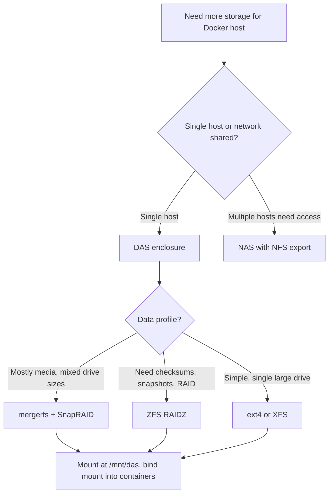

# DAS Solutions, Local Storage, and Backup Solutions: A Guide for Home Lab Docker Builders

> [!abstract] TL;DR
> DAS is the simplest path to more storage for a Docker home server — plug in an enclosure, mount the drives, bind mount into containers. Use ext4/XFS on the system disk for Docker's overlay2, mergerfs+snapraid or ZFS for the data pool, and restic or offen/docker-volume-backup for backups. The 3-2-1 rule is not optional — your compose files are infrastructure, your container volumes are irreplaceable, and RAID is not backup.

## Why This Matters to You

You run Docker. You have compose stacks — maybe Jellyfin, the *arr suite, Nextcloud, Home Assistant, a database or two. Your single drive or basic setup is running out of room, your backup strategy is "I should probably do that," and you're ready to architect something that won't fall apart when a drive dies at 2am.

DAS, filesystem choices, and backup tooling are the infrastructure layer that sits underneath every `volumes:` block in your compose files. Get this right and everything is findable, backupable, and recoverable. Get it wrong and you're reconstructing months of configuration from memory.

## What This Is NOT

> [!warning] Wrong mental models to discard

- **DAS is not NAS.** DAS is direct-attached — no network layer, no file sharing protocol. It's drives plugged into your server. NAS adds TCP/IP overhead and a separate device to maintain. For a single Docker host, DAS is simpler and faster.
- **Hardware RAID is not the answer.** Enclosures with built-in RAID controllers lock you into a vendor. If the enclosure dies, your array may be unreadable in a replacement. Software RAID (ZFS, mdadm, mergerfs) gives you control.
- **RAID is not backup.** RAID protects against drive failure. It does not protect against `docker compose down -v`, ransomware, corruption, or accidental deletion. You need separate backup copies.
- **"I'll set up backups later" is the home lab graveyard.** The tools are free, cloud storage is cheap, and the compose file you already wrote is half the recovery plan.

---

## DAS Hardware & Connectivity

If you've hit the wall where one drive fills up and you're managing bind mounts across `/mnt/disk1` and `/mnt/disk2`, DAS is the cleanest way out. No network stack, no SMB/NFS config, no separate device. Plug in an enclosure, the OS sees the drives, your container volumes keep working.

DAS offers the highest performance and simplest setup for isolated applications requiring no network sharing ([BMC](https://www.bmc.com/blogs/das-vs-nas-vs-san/)). For a home lab running Docker — bind mounts, named volumes, databases — you get full disk throughput without network latency.

### Enclosures

| Enclosure | Bays | Interface | Max Capacity | Notes |
|-----------|------|-----------|-------------|-------|
| [QNAP TR-004](https://www.amazon.com/QNAP-TR-004-Enclosure-Attached-hardware/dp/B07K4RC7X9) | 4 | USB-C | - | Hardware RAID built in (see caveat below) |
| [TerraMaster D4-320](https://www.terra-master.com/products/d4-320) | 4 | USB 3.2 Gen 2 | 88TB | Straightforward JBOD option |
| [TerraMaster D8 Hybrid](https://www.amazon.com/TERRAMASTER-D8-Hybrid-Enclosure-Exclusive/dp/B0D3YZSK95) | 8 | USB 3.2 Gen 2 | 152TB | Mixed HDD + NVMe slots |
| Sabrent 4-Bay | 4 | USB 3.2 Gen 2 | - | Budget option, frequently discussed in r/homelab |

USB 3.2 Gen 2 at 10Gbps is plenty for media storage and container volumes. USB4/Thunderbolt (40Gbps) exists via ATTO adapters but the cost is hard to justify for home use _(~inferred: limited consumer adoption due to price)_. For enterprise-grade reliability, an LSI 9211-8i SAS HBA card opens up the used enterprise drive ecosystem.

> [!warning] Skip the hardware RAID
> Hardware RAID in enclosures like the TR-004 locks you into the controller vendor ([DiskInternals](https://www.diskinternals.com/raid-recovery/zfs-vs-mdadm-raid/)). If the unit dies, you need an identical controller to read the array. Software RAID (ZFS, mdadm, mergerfs) keeps you in control.

### Drive Economics

| Type | Cost/GB | Best for |
|------|---------|----------|
| 16TB HDD | ~$0.014/GB ([PreRackIT](https://prerackit.com/why-ssd-prices-have-surged-while-hdds-stay-put-the-2025-storage-cost-divide-explained/)) | Bulk media, backups, archive |
| NVMe SSD | 5-6x more per TB | VM disks, databases, Docker system disk |
| Shucked WD Easystore | Consumer external price → NAS-grade WD Red inside ([tynick.com](https://tynick.com/blog/09-28-2020/how-to-shuck-a-western-digital-easystore-or-elements-external-drive/)) | The home lab classic |
| Used enterprise SAS (eBay) | ~$110-120/8TB ([TrueNAS Community](https://www.truenas.com/community/threads/used-ebay-sas-enterprise-drives-pool-suicide-or-useful-budget-option.77806/)) | Requires SAS HBA, check SMART first |

The practical pattern: NVMe for the Docker host OS + overlay2, HDDs for the data pool. Monitor everything with `smartmontools` ([smartmontools.com](https://smartmontools.com/)) — watch reallocated sector counts and temperature.

---

## Filesystem & Volume Management

### The Split: Boring Host, Interesting Data Pool

For the system disk where Docker lives (overlay2, images, container layers): **ext4**. Stable since 2008, overlay2's recommended filesystem ([Proxmox forums](https://forum.proxmox.com/threads/choose-between-ext4-xfs-zfs-and-btrfs-why.135128/)). XFS works too but requires `ftype=1` at format time ([Docker docs](https://docs.docker.com/engine/storage/drivers/overlayfs-driver/)). Check with `xfs_info / | grep ftype` before assuming.

For the data pool, two paths dominate:

### mergerfs + SnapRAID: The Home Lab Darling

[mergerfs pools drives without striping](https://thenomadcode.tech/mergerfs-snapraid-is-the-new-raid-5) — each file lives on one physical drive. [SnapRAID adds file-level parity snapshots](https://perfectmediaserver.com/02-tech-stack/snapraid/), not real-time block RAID. Why home labbers love it:

- **Mix drive sizes freely.** A 4TB, 8TB, and 14TB coexist without wasting space.
- **Adding drives is trivial.** Drop one in, add to config, done. No rebuild, no rebalance.
- **Parity runs on schedule** (nightly), not in real-time. Your reads aren't taxed.
- **A single drive failure loses only the files on that drive**, not the whole pool.

The tradeoff: not suitable for databases or high-write workloads ([Zack Reed](https://zackreed.me/posts/snapraid-mergerfs-on-ubuntu-24.04/)). Your PostgreSQL container should live on a dedicated drive or LVM, not the mergerfs pool.

> [!tip] The home lab media stack split
> mergerfs+SnapRAID for Plex/Jellyfin media libraries, downloads, ISOs. Dedicated ext4/XFS volume for database containers and application state.

### ZFS: The Power Move

[ZFS combines RAID, snapshots, and checksums](https://blog.usro.net/2024/10/ext4-vs-zfs-vs-xfs-vs-btrfs-linux-file-systems/) — datasets map cleanly to Docker bind mounts, snapshots give you rollback before a container upgrade goes sideways, and checksums detect silent bit rot that RAID misses.

The honest RAM conversation: the ARC cache defaults to `max(RAM - 1GB, 5/8 × RAM)` ([blog.thalheim.io](https://blog.thalheim.io/2025/10/17/zfs-ate-my-ram-understanding-the-arc-cache/)). On a 16GB server, ZFS will consume ~10GB for cache. The 1GB/TB rule ([cr0x.net](https://cr0x.net/en/zfs-arc-ram-sizing/)) is workable at 32GB, tight at 16GB. **Never enable deduplication** unless you have 128GB+ RAM — it balloons to 5GB/TB ([FreeBSD forums](https://forums.freebsd.org/threads/zfs-memory-requirements.87473/)).

Advanced vdevs worth knowing: **special metadata vdev** (SSD for inode caching — real speedup for large file counts), **SLOG** (for sync-write databases), **L2ARC** (read cache, only useful above ~60GB RAM) ([Klara Systems](https://klarasystems.com/articles/performance-tuning-arc-l2arc-slog/)).

### Encryption

[LUKS encrypts the entire block device](https://linuxconfig.org/protecting-data-integrity-on-ext4-and-xfs-with-dm-integrity-and-luks) — pair with ext4/XFS and dm-integrity for bitrot detection. [ZFS native encryption](https://blog.elcomsoft.com/2021/11/protecting-linux-and-nas-devices-luks-ecryptfs-and-native-zfs-encryption-compared/) protects datasets but leaks metadata (sizes, structure). Both are production-ready.

---

## Docker Storage Integration

### The Directory Convention

Converge on `/opt/docker` or `/srv/docker` as the root for all container state _(unsourced — community convention, not a Docker standard)_. The pattern:

```
/opt/docker/
├── jellyfin/
│   └── config/
├── sonarr/
│   └─�� config/
├── nextcloud/
│   └── config/
└── docker-compose.yml
```

When your backup job runs, it targets `/opt/docker` and gets everything. When you're SSHed in at 2am, you know where to look.

### The DAS → Bind Mount → Container Pattern

Mount the DAS on the host, bind mount paths into containers. No NFS from the same machine — it's twelve inches away, skip the network stack.

```yaml
services:
  jellyfin:
    image: lscr.io/linuxserver/jellyfin
    environment:
      - PUID=1000
      - PGID=1000
    volumes:
      - /opt/docker/jellyfin/config:/config
      - /mnt/das/media/tv:/data/tv
      - /mnt/das/media/movies:/data/movies

  sonarr:
    image: lscr.io/linuxserver/sonarr
    environment:
      - PUID=1000
      - PGID=1000
    volumes:
      - /opt/docker/sonarr/config:/config
      - /mnt/das/media/tv:/tv
      - /mnt/das/downloads:/downloads
```

The `PUID`/`PGID` environment variables are the linuxserver.io solution to the permission problem that trips up every home labber the first time _(unsourced)_. The container runs as the specified UID/GID, matching host filesystem ownership. Without this: 403s in Jellyfin, Sonarr refusing to move downloads.

### Named Volumes vs Bind Mounts

**Bind mounts** for everything you want to find, inspect, or back up: config dirs, media libraries, databases. **Named volumes** for ephemeral or Docker-internal state ([Docker docs](https://docs.docker.com/engine/storage/volumes/)). Overlay2 and container layers live on the system disk and are reconstructible from images — they don't need backup.

### Podman on Fedora/Bazzite

If you're running rootless Podman, two things change:
- Podman does not create bind mount directories implicitly — `mkdir -p` first or it fails ([Podman comparison](https://oneuptime.com/blog/post/2026-03-16-named-volumes-vs-bind-mounts-podman/view))
- Add `:z` to writable bind mounts for SELinux labels, or you get permission denied that looks like ownership problems but is actually a label mismatch
- Use `podman unshare ls -la /opt/docker/sonarr/config` to see what the host actually sees through the UID mapping layer

---

## Backup Solutions

### Your Compose File Is Infrastructure

Before touching a backup tool: your `docker-compose.yml` and `.env` files are your infrastructure definition. Lose the data but keep the compose file and you can rebuild. Lose the compose file and you're reconstructing from memory. These files are small, should live in git, and should be in every backup job.

### The 3-2-1 Rule, Practically

Three copies, two media types, one offsite ([Virtualization Howto](https://www.virtualizationhowto.com/2025/10/ultimate-home-lab-backup-strategy-2025-edition/)). For a Docker home lab:

1. **Local on DAS** — primary copy, where containers read/write
2. **Cloud** — restic to Backblaze B2 or Wasabi
3. **Friend's NAS or second location** — restic REST server (lightweight Go binary)

### Tool Comparison

| Tool | Strengths | Best for |
|------|-----------|----------|
| **[restic](https://dev.to/selfhostingsh/restic-vs-kopia-vs-borgbackup-2lmn)** | Single binary, AES-256, S3/B2/SFTP backends | The default choice — start here |
| **[BorgBackup](https://onidel.com/blog/restic-vs-borgbackup-vs-kopia-2025)** | Best compression, borgmatic for YAML automation | Storage-constrained setups |
| **[Kopia](https://cavecreekcoffee.com/reviews/best-linux-backup-software-2026/)** | Web UI, parallel uploads (fast initial seed), multi-machine dashboard | Multi-host labs |
| **[Duplicati](https://cavecreekcoffee.com/reviews/best-linux-backup-software-2026/)** | GUI-first, web scheduling | Less technical users |
| **rclone** | 70+ cloud providers, sync transport ([dev.to](https://dev.to/lovestaco/restic-vs-rclone-vs-rsync-choosing-the-right-tool-for-backups-gn9)) | Transport layer, not a standalone backup tool |

### Docker-Native Backups

**[offen/docker-volume-backup](https://github.com/offen/docker-volume-backup)** runs as a container alongside your stack — S3, WebDAV, local, GPG encryption, rotation. The Docker-native pattern home labbers love.

For databases: always `pg_dump`/`mongodump`, not raw volume copies ([Polyglot Developer](https://www.thepolyglotdeveloper.com/2025/05/easy-automated-docker-volume-backups-that-are-database-friendly/)). Live database files are not guaranteed consistent when tarred from outside the database process.

### ZFS Send/Receive

If you're on ZFS, `zfs send/receive` is the most efficient local replication available — incremental, compressed, snapshot-native ([Level1Techs](https://forum.level1techs.com/t/zfs-btrfs-lvm-with-vms-and-backups/182458/)). Replicate to a second pool or DAS. Doesn't replace offsite cloud backup, but for local copies it's unmatched.

### Offsite Cloud Targets

| Provider | Egress | Notes |
|----------|--------|-------|
| [Backblaze B2](https://www.wundertech.net/backup-synology-nas-to-backblaze-b2-using-hyper-backup/) | Costs above 1GB/day | Tight restic integration, well-documented |
| [Wasabi](https://forum.rclone.org/t/wasabi-vs-backblaze-b2-experiences/31364) | No egress fees | Better for restore-heavy scenarios |
| rsync.net | N/A ([lobste.rs](https://lobste.rs/s/c8long/where_do_you_host_your_back_ups)) | Simple but expensive per GB |

### Automation

Systemd timers beat cron — proper logging, failure notifications, `journalctl` integration ([dev.to](https://dev.to/selfhostingsh/borgmatic-vs-restic-which-backup-tool-to-use-4bgo)). [restic-automatic-backup-scheduler](https://github.com/erikw/restic-automatic-backup-scheduler) and [borgmatic](https://github.com/witten/borgmatic/blob/master/sample/systemd/borgmatic.timer) both ship systemd timer examples.

---

## Quick Reference

### Storage Architecture Decision Tree



### Essential Commands

| Task | Command |
|------|---------|
| Check DAS mount | `lsblk` / `mount \| grep das` |
| SMART health check | `sudo smartctl -a /dev/sdX` |
| ZFS pool status | `zpool status` |
| ZFS snapshot | `zfs snapshot pool/dataset@$(date +%Y%m%d)` |
| ZFS scrub | `zpool scrub pool` |
| mergerfs pool status | `df -h /mnt/storage` |
| SnapRAID sync | `snapraid sync` |
| SnapRAID scrub | `snapraid scrub` |
| Docker volume list | `docker volume ls` |
| Backup with restic | `restic -r /path/to/repo backup /opt/docker` |
| Restore with restic | `restic -r /path/to/repo restore latest --target /opt/docker` |
| Check overlay2 filesystem | `docker info \| grep "Storage Driver"` |
| XFS ftype check | `xfs_info / \| grep ftype` |

---

## Gotchas & Pitfalls

> [!danger] Things that WILL trip you up

1. **Permission denied in containers is almost always PUID/PGID or SELinux.** Check `ls -la` on the host path first. On Podman, add `:z` to the bind mount. On Docker, set `PUID`/`PGID` to match the host user _(unsourced)_.

2. **overlay2 on XFS requires `ftype=1`.** If your XFS was formatted without it, overlay2 silently misbehaves. Check before you chase phantom container issues ([Docker docs](https://docs.docker.com/engine/storage/drivers/overlayfs-driver/)).

3. **Shucked drives sometimes have the 3.3V pin issue.** Some WD drives pulled from enclosures won't spin up in a SATA bay because pin 3 on the SATA power connector sends a reset signal. Cover it with Kapton tape or use a compatible backplane _(unsourced)_.

4. **ZFS deduplication will eat your RAM.** At 5GB/TB, a 32TB pool needs 160GB of RAM just for the dedup table. Don't enable it. Use compression (`lz4` or `zstd`) instead — it's nearly free _(~inferred: based on ZFS performance documentation patterns)_.

5. **mergerfs+SnapRAID is not for databases.** SnapRAID syncs parity on a schedule, not in real-time. A database write between syncs is unprotected. Keep databases on a dedicated volume outside the pool.

6. **`docker compose down -v` deletes named volumes.** The `-v` flag is destructive. It removes volumes declared in the compose file. If your data is in a named volume and you run this, it's gone. Bind mounts are unaffected.

7. **NFS from the same machine is unnecessary for DAS.** If the drives are physically attached to your Docker host, just mount and bind mount. Adding NFS between a local disk and a local container is overhead with no benefit.

8. **Backblaze B2 charges for egress.** Free daily egress is limited to 1GB. When you need to restore 500GB, the bill arrives. Wasabi has no egress fees — know the difference before you need to restore ([rclone forum](https://forum.rclone.org/t/wasabi-vs-backblaze-b2-experiences/31364)).

9. **Forgetting to schedule ZFS/SnapRAID scrubs.** Scrubs detect silent corruption before it spreads. Set a cron job or systemd timer — monthly for ZFS, weekly for SnapRAID. Undetected bit rot is the kind of data loss that RAID doesn't prevent _(unsourced)_.

10. **RAID is not backup.** This is the mantra. Corruption propagates. Accidental deletion propagates. Ransomware propagates. Your mergerfs pool, your ZFS RAIDZ, your mdadm array — none of them protect against anything except drive failure. Back up separately, offsite, encrypted ([Coda](https://coda.io/@ff0/home-lab-data-vault)) _(link unverified)_.

---

## Further Reading

**DAS & Hardware:**
- [TechTarget — DAS vs NAS vs SAN](https://www.techtarget.com/searchstorage/answer/The-difference-between-SAN-and-NAS) — Definitions and when each applies
- [smartmontools](https://smartmontools.com/) — Drive health monitoring

**Filesystems:**
- [Perfect Media Server — SnapRAID](https://perfectmediaserver.com/02-tech-stack/snapraid/) — The mergerfs+SnapRAID reference
- [OpenZFS FAQ](https://openzfs.github.io/openzfs-docs/Project%20and%20Community/FAQ.html) — Licensing, features, compatibility
- [45 Drives — Linux RAID vs ZFS RAID](https://www.45drives.com/community/articles/linux-raid-vs-zfs-raid/) — Comparison for self-hosters

**Docker Storage:**
- [Docker Volumes Documentation](https://docs.docker.com/engine/storage/volumes/) — Official reference
- [Docker Bind Mounts Documentation](https://docs.docker.com/engine/storage/bind-mounts/) — When and how to use them
- [offen/docker-volume-backup](https://github.com/offen/docker-volume-backup) — Automated container-native backups

**Backup Tools:**
- [restic](https://restic.net/) — The community-recommended starting point
- [borgmatic](https://torsion.org/borgmatic/) — BorgBackup wrapper with YAML config
- [Kopia](https://kopia.io/) — Newer tool with web UI and parallel uploads
- [Virtualization Howto — Home Lab Backup Strategy 2025](https://www.virtualizationhowto.com/2025/10/ultimate-home-lab-backup-strategy-2025-edition/) — Comprehensive guide

**Budget Storage:**
- [WD Easystore Shucking Guide](https://tynick.com/blog/09-28-2020/how-to-shuck-a-western-digital-easystore-or-elements-external-drive/) — The home lab rite of passage
- [TrueNAS Community — Used Enterprise SAS Drives](https://www.truenas.com/community/threads/used-ebay-sas-enterprise-drives-pool-suicide-or-useful-budget-option.77806/) — Risk assessment
